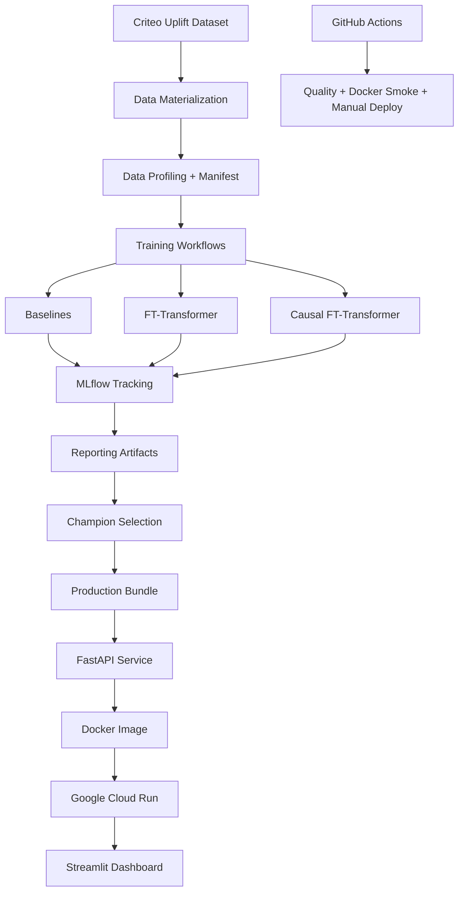

# Causal Uplift Transformer Beam

[](https://www.python.org/downloads/release/python-3120/)
[](https://github.com/astral-sh/uv)
[](https://fastapi.tiangolo.com/)
[](https://streamlit.io/)
[](https://mlflow.org/)
[](https://www.docker.com/)
[](https://cloud.google.com/run)
[](https://github.com/sundar139/Causal-Uplift-Transformer-Beam/actions/workflows/ci.yml)
[](https://github.com/sundar139/Causal-Uplift-Transformer-Beam/actions/workflows/docker.yml)
[](https://github.com/sundar139/Causal-Uplift-Transformer-Beam)

Production-grade causal uplift modeling system with full-dataset training, transformer challengers, MLflow experiment tracking, Optuna tuning, Cloud Run deployment, Streamlit dashboard, and GitHub Actions CI/CD.

This repository predicts incremental treatment effect, not only conversion propensity. It benchmarks classical uplift baselines against FT-Transformer and causal FT-Transformer challengers, then deploys the empirically selected champion model by full-test Qini AUC. It includes reproducible configs, tracked experiment artifacts, production bundle contracts, Dockerized serving, a Streamlit client, and CI/CD workflows.

## Executive Summary

| Area | Implementation |
|---|---|
| Problem | Uplift modeling / treatment effect ranking |
| Dataset | Criteo Uplift Prediction |
| Training scale | Full: 13,979,592 rows (train 8,387,755, validation 2,795,918, test 2,795,919) |
| Champion metric | Qini AUC |
| Production champion | s_learner_logistic (from artifacts/reports/full/best_model_summary.json) |
| Deployment | FastAPI + Docker + Google Cloud Run |
| Dashboard | Streamlit |
| Tracking | MLflow SQLite |
| Tuning | Optuna |
| CI/CD | GitHub Actions |

## Why Uplift Modeling

A standard classifier estimates conversion probability $P(Y=1 \mid X)$. Uplift modeling estimates incremental treatment effect and targets users only when treatment is expected to improve outcome.

```math
\tau(x) = \mu_1(x) - \mu_0(x)
```

```math
\mu_1(x) = P(Y=1 \mid X=x, T=1)
```

```math
\mu_0(x) = P(Y=1 \mid X=x, T=0)
```

This reduces spend on users who would convert anyway and helps avoid targeting users with negative treatment effect.

## Dataset And Lineage

- Dataset: Criteo Uplift Prediction
- Source loader: scikit-uplift (`sklift.datasets.fetch_criteo`)
- Target column: `conversion`
- Treatment column: `treatment`
- Features: `f0` through `f11` (12 features)

### Percent10 Mode (from artifacts/data/percent10/data_manifest.json)

- Total rows: 1,397,960
- Train: 978,572
- Validation: 209,694
- Test: 209,694
- Treatment rate (train): 0.8500008175
- Outcome rate (train): 0.0029164946

### Full Mode (from artifacts/data/full/data_manifest.json)

- Total rows: 13,979,592
- Train: 8,387,755
- Validation: 2,795,918
- Test: 2,795,919
- Treatment rate (train): 0.8500001490
- Outcome rate (train): 0.0029167519

Raw and processed parquet files are intentionally git-ignored to keep repository size manageable and environment-independent. Lightweight lineage artifacts in `artifacts/data/` are tracked for reproducibility.

Regenerate data locally:

```bash
uv run python -m causal_uplift.data materialize --config configs/training_full.yaml
uv run python -m causal_uplift.data profile --config configs/training_full.yaml
```

## System Architecture



```text
src/causal_uplift/       core package
configs/                 reproducible training and tuning configs
artifacts/               lightweight reports, metrics, and plots
models/production/       production inference bundle
app/                     Streamlit dashboard
docs/                    data card and deployment docs
.github/workflows/       CI, Docker validation, manual Cloud Run deploy
```

## Modeling Decisions And Formulas

### A) Two-model logistic / T-learner

```math
\hat{\tau}(x) = \hat{\mu}_1(x) - \hat{\mu}_0(x)
```

- Separate outcome models for treated and control groups.
- Clear treatment/control separation.
- Can become unstable if one subgroup has weaker signal.

### B) S-learner logistic

```math
\hat{\mu}(x,t) = P(Y=1 \mid X=x, T=t)
```

```math
\hat{\tau}(x) = \hat{\mu}(x,1) - \hat{\mu}(x,0)
```

- Single model with treatment as a feature.
- Stable on Criteo's compact numeric feature space.
- Production champion by Qini AUC on the full test set.

### C) FT-Transformer S-learner

```math
z = Transformer(Tokenize([x, t]))
```

```math
\hat{y} = \sigma(Wz + b)
```

```math
\hat{\tau}(x) = \hat{y}(x,1) - \hat{y}(x,0)
```

- Captures nonlinear interactions.
- Useful challenger.
- Not auto-deployed when Qini ranking does not win.

### D) Causal FT-Transformer two-head challenger

```math
z = Transformer(Tokenize(x))
```

```math
\hat{\mu}_0(x) = \sigma(h_0(z))
```

```math
\hat{\mu}_1(x) = \sigma(h_1(z))
```

```math
\hat{\tau}(x) = \hat{\mu}_1(x) - \hat{\mu}_0(x)
```

```math
\mathcal{L}_{factual}
=
(1-T)\,BCE(Y,\hat{\mu}_0(X))
+
T\,BCE(Y,\hat{\mu}_1(X))
```

```math
\mathcal{L}_{propensity} = BCE(T,\hat{e}(X))
```

```math
\mathcal{L}
=
\lambda_f \mathcal{L}_{factual}
+
\lambda_p \mathcal{L}_{propensity}
+
\lambda_b \mathcal{L}_{balance}
```

- Separate potential-outcome heads.
- Group-balanced factual loss.
- Positive-class weighting.
- Qini-based checkpointing.
- Multi-seed ensemble.
- Final full-test Qini still trails deployed champion.

## Metrics And Selection Policy

- Primary metric: Qini AUC
- Tie-breaker: policy_gain_top20
- Treatment response AUC is reported, not used as champion selector.

```math
score_i = \hat{\tau}(x_i)
```

```math
\pi_k(x_i)=1 \quad \text{if } score_i \text{ is in top } k\%
```

```math
Gain@k =
E[Y \mid T=1, \pi_k(X)=1]
-
E[Y \mid T=0, \pi_k(X)=1]
```

```math
Champion =
\arg\max_m
\left(
QiniAUC_m,\,
PolicyGain@20_m
\right)
```

## Experimentation Results

### Before tuning

The current repository does not preserve a separate immutable pre-tuning result file; latest available report artifacts are shown below.

### After Optuna tuning

#### Percent10 (artifacts/tuning/percent10/tuning_summary.json)

- Trials requested: ft_transformer 20, s_learner_logistic 20
- Trials completed: ft_transformer 40, s_learner_logistic 40
- Best model family during tuning: ft_transformer
- Best validation Qini AUC: 0.2114799669
- Selected FT params: embedding_dim 64, num_layers 3, num_heads 2, dropout 0.1833492767, hidden_dim 128, learning_rate 0.0002031150, weight_decay 3.1552e-05, batch_size 1024
- Selected S-learner params: C 0.0100020315, penalty l2, class_weight null, max_iter 500

#### Full (artifacts/tuning/full/tuning_summary.json)

- Trials requested: ft_transformer 8, s_learner_logistic 8
- Trials completed: ft_transformer 8, s_learner_logistic 8
- Best model family during tuning: ft_transformer
- Best validation Qini AUC: 0.1845283425
- Selected FT params: embedding_dim 96, num_layers 3, num_heads 8, dropout 0.1134470043, hidden_dim 256, learning_rate 0.0003109841, weight_decay 0.0001868764, batch_size 1024
- Selected S-learner params: C 0.0105966315, penalty l2, class_weight null, max_iter 500

### After causal FT-Transformer upgrade

From artifacts/reports/full/model_ranking.csv and artifacts/reports/full/champion_challenger_summary.json.

| Rank | Model | Qini AUC | Policy Gain@20 | Uplift AUC | Treatment Response AUC | Role |
|---:|---|---:|---:|---:|---:|---|
| 1 | s_learner_logistic | 0.1866207298 | 0.0049028178 | 0.0060406907 | 0.9502187140 | Production Champion |
| 2 | two_model_logistic | 0.1812408794 | 0.0048195291 | 0.0058620426 | 0.9502282921 | Baseline |
| 3 | t_learner_logistic | 0.1812408794 | 0.0048195291 | 0.0058620426 | 0.9502282921 | Baseline |
| 4 | ft_transformer | 0.1809316597 | 0.0048313134 | 0.0058541582 | 0.9566008614 | Transformer Challenger |
| 5 | ft_transformer_causal | 0.1383733762 | 0.0031845841 | 0.0044781112 | 0.9477893860 | Causal Transformer Challenger |
| 6 | ft_transformer_causal_ensemble | 0.1283747707 | 0.0029497645 | 0.0041540635 | 0.9521401525 | Causal Transformer Challenger |

Champion rationale:

- Production champion is selected by Qini AUC on full test set, tie-broken by policy_gain_top20.
- Current champion: s_learner_logistic.
- Champion/challenger artifact states `transformer_won: false` with recommendation to keep non-transformer champion in production.

This is explicit model governance: deployment follows measured uplift ranking, not model branding.

## Production Deployment On Google Cloud Run

Deployed API URL:

- https://causal-uplift-api-sn6k6nocwq-uc.a.run.app

Production bundle is built from the selected champion and includes:

- champion_model.joblib
- preprocessor.joblib
- model_metadata.json
- feature_schema.json
- prediction_contract.json

Serving endpoints:

- /health
- /model-info
- /predict_uplift
- /predict_batch

Serving image design:

- Slim Docker image for inference only.
- Not a full training environment.
- Cloud Run configured with min instances 0 and max instances 2 for cost control.

Build commands:

```bash
uv run python scripts/build_inference_bundle.py --config configs/training_full.yaml
uv run python scripts/check_production_bundle.py
docker build -t causal-uplift-api:local .
```

## Issues Encountered And Resolutions

| Issue | Root Cause | Resolution | Engineering Lesson |
|---|---|---|---|
| data/raw and data/processed empty | Dataset is fetched dynamically via scikit-uplift | Added materialization workflow, data manifest, and data card | Track lineage artifacts in Git; keep heavy parquet local |
| Only 10% dataset used initially | Config used percent10 mode for iteration | Added full-data config and full materialization paths | Keep smoke and full-scale configs separate |
| MLflow FileStore limitations | Local file backend warnings and weaker metadata ops | Standardized on SQLite-backed MLflow | Lightweight local tracking can still be robust with SQLite |
| FT-Transformer did not consistently beat logistic | Response modeling quality is not identical to uplift ranking quality | Retained honest champion selection; transformer as challenger | Choose deployment by uplift objective, not architecture trend |
| Causal FT still did not win | Added complexity did not improve final full-test Qini ranking | Kept as challenger and deployed empirical champion | Complexity must earn promotion via target metric |
| Cloud Run model_loaded false | Model bundle files missing from build context | Fixed ignore rules and ensured production bundle inclusion | Deployment context hygiene is critical |
| Cloud Build copied unnecessary payload | Docker/GCloud context included heavy local artifacts | Slim serving Dockerfile and explicit ignore files | Build context discipline speeds and stabilizes delivery |
| Docker health check empty reply | Readiness timing race right after container start | Added readiness loop / delayed checks + logs inspection | Treat readiness as semantic health, not just port open |
| Streamlit import issues | Direct-run module path differences | Added compatibility import fallback | Entry-point execution mode should be resilient |
| Streamlit use_container_width deprecation | Streamlit API evolution | Replaced with width="stretch" | Keep UI dependencies current to avoid silent drift |

## Why This Repository Is Industry-Standard

- Reproducible config-driven workflows
- Explicit data materialization and lineage manifests
- Smoke validation before full-scale runs
- Full-dataset training and evaluation path
- MLflow experiment tracking
- Optuna-based tuning for key model families
- Champion/challenger governance
- Honest metric-based champion promotion
- Contracted production inference bundle
- FastAPI serving contract for single and batch predictions
- Slim Docker serving image
- Cloud Run deployment path with cost controls
- Streamlit operations dashboard/client
- GitHub Actions quality + Docker smoke + manual deploy
- Manual production deploy via Workload Identity Federation
- Tests across data, model logic, API contract, app contract, and bundle contract
- No raw dataset parquet committed

## How To Run

### Setup

```bash
uv sync --all-groups
```

### Smoke training

```bash
uv run python -m causal_uplift.train smoke --sample-size 10000
```

### Full data materialization

```bash
uv run python -m causal_uplift.data materialize --config configs/training_full.yaml
uv run python -m causal_uplift.data profile --config configs/training_full.yaml
```

### Full training

```bash
uv run python -m causal_uplift.train full --config configs/training_full.yaml
```

### Tuning

```bash
uv run python -m causal_uplift.tuning --config configs/tuning_full.yaml
```

### Causal FT challenger

```bash
uv run python -m causal_uplift.train causal-ft --config configs/training_causal_ft_full.yaml
```

### Reporting

```bash
uv run python -m causal_uplift.train report --config configs/training_full.yaml
```

### Build bundle

```bash
uv run python scripts/build_inference_bundle.py --config configs/training_full.yaml
uv run python scripts/check_production_bundle.py
```

### Run API

```bash
uv run python -m uvicorn causal_uplift.serve:app --host 127.0.0.1 --port 8080
```

### Run Streamlit dashboard

```powershell
$env:CAUSAL_UPLIFT_API_URL="https://causal-uplift-api-sn6k6nocwq-uc.a.run.app"
uv run streamlit run app/streamlit_app.py
```

### Run CI checks locally

```bash
uv run ruff check src tests scripts app
uv run python -m black --check src tests scripts app
uv run python -m pytest
uv run python scripts/check_production_bundle.py
```

## API Example

```json
{
  "features": {
    "f0": 0.1,
    "f1": 0.2,
    "f2": 0.3,
    "f3": 0.4,
    "f4": 0.5,
    "f5": 0.6,
    "f6": 0.7,
    "f7": 0.8,
    "f8": 0.9,
    "f9": 1.0,
    "f10": 1.1,
    "f11": 1.2
  }
}
```

## Dashboard

The Streamlit app reads backend URL from `CAUSAL_UPLIFT_API_URL` and supports:

- Overview and champion metrics
- Single prediction
- Batch CSV upload

Sample batch input file:

- examples/sample_batch.csv

## CI/CD

Workflows:

- .github/workflows/ci.yml
- .github/workflows/docker.yml
- .github/workflows/cloud-run-deploy.yml

Deployment workflow is manual-only and uses Workload Identity Federation.

Full training is intentionally excluded from CI to keep feedback fast, deterministic, and credential-free for pull requests.
